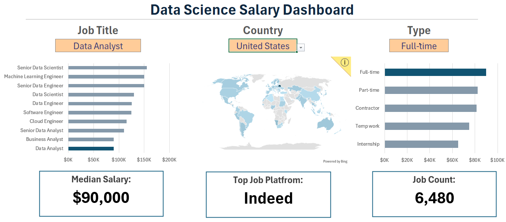

# Mina Gobran - Data Analyst Portfolio

**Transforming and Analyzing Data into Actionable Insights**

[View Projects](#featured-projects) • [About Me](#about-me) • [Skills](#technical-skills) • [Contact](#-lets-connect)

---

## 👋 Welcome!

I'm an aspiring data analyst passionate about uncovering stories hidden in data and translating complex datasets into clear, impactful insights. This portfolio showcases my journey from Excel foundations to advanced SQL analytics and interactive Power BI visualizations, I'm also using my time to learn Python and Machine learning for enhancing and adding to my skills.

**What I Do:**
-  Business Intelligence & Analytics
-  E-Commerce & Retail Analysis  
-  Interactive Dashboard Development
-  Data-Driven Decision Support
-  Not so proficient  yet but I also collect data via API integeration and Python automation

---

## Featured Projects

### 1️⃣ E-Commerce Data Analytics
> **End-to-end analysis of Olist Brazilian e-commerce platform**

**Overview:** Comprehensive analysis covering sales trends, customer retention, delivery performance, and seller metrics to support data-driven business decisions.

**Key Insights:**
-  Customer churn rate of **71%+** identified as critical issue
-  Delivery performance at **93% on-time rate**
-  Recommended loyalty programs and retention strategies

**Technologies:** `SQL` `PostgreSQL` `Power BI` `Data Cleaning`

**What I Learned:** End-to-end data pipeline from raw data processing to business recommendations

[**→ View Full Project**](https://github.com/Mina-Gobran/E-Commerce_Olist_Analysis)

---

### 2️⃣ Superstore Sales Analysis
> **Interactive Excel dashboard for retail performance tracking**

**Overview:** Analyzed 9,994 orders from 2014-2017 with interactive features including segment filters, order lookups, heatmaps, and trend analysis.

**Key Insights:**
-  West region leads in sales performance
-  Technology category drives highest profit margins
-  High-return items identified as profit erosion factor

**Technologies:** `Excel` `Pivot Tables` `Advanced Formulas` `Data Visualization`

**What I Learned:** Building professional-grade dashboards with Excel's native features for quick business insights

[**→ View Full Project**](https://github.com/Mina-Gobran/SuperStore_Project_Analysis)

---

### 3️⃣ SQL Job Market Analysis
> **Data-driven exploration of data analyst career landscape**

**Overview:** Queried PostgreSQL database to identify top-paying roles, most in-demand skills, and salary optimization strategies in the data analyst job market.

**Key Insights:**
-  Skills like **Tableau, AWS, Azure** linked to higher compensation
-  Remote opportunities analyzed for location flexibility
-  **SQL, Python, Tableau** identified as essential skill trio

**Technologies:** `SQL` `PostgreSQL` `CTEs` `Joins` `Aggregations`

**What I Learned:** Complex query optimization and real-world application of SQL for strategic career insights

[**→ View Full Project**](https://github.com/Mina-Gobran/SQL_Project_Data_job_analysis)

---

### 4️⃣ Power BI Dashboards
> **Collection of interactive business intelligence visualizations**

**Overview:** Portfolio of Power BI dashboards demonstrating data modeling, DAX calculations, and interactive visualization techniques across various business scenarios.

**Key Features:**
-  Dynamic KPI tracking with drill-down capabilities
-  Trend analysis with time-intelligence functions
-  Interactive filters for multi-dimensional analysis

**Technologies:** `Power BI` `DAX` `Data Modeling` `ETL`

**What I Learned:** Advanced visualization techniques and creating user-friendly analytical interfaces

[**→ View Full Project**](https://github.com/Mina-Gobran/Power_bi_Dashboard)

---

### 5️⃣ Excel Salary Analytics
> **Comprehensive analysis of data professional compensation and skills**

**Overview:** Dual-component project featuring a salary exploration dashboard for job seekers and skills analysis examining what top employers seek in data professionals.

**Key Components:**
-  **Salary Dashboard:** Interactive tool for exploring compensation by role, location, and experience
-  **Skills Analysis:** Mapping of in-demand skills to salary potential

**Technologies:** `Excel` `Dashboard Design` `Statistical Analysis`

**What I Learned:** Creating practical, career-oriented analytical tools that directly support decision-making

[**→ View Full Project**](https://github.com/Mina-Gobran/Excel_project_data_analytics)

---

## Technical Skills

<table>
<tr>
<td valign="top" width="50%">

### Data Analysis & Querying
- **SQL/PostgreSQL** - Complex queries, CTEs, window functions
- **Excel** - Advanced formulas, pivot tables, data modeling
- **Data Cleaning** - ETL processes, data validation
- **Statistical Analysis** - Trend analysis, forecasting

</td>
<td valign="top" width="50%">

### Visualization & BI
- **Power BI** - DAX, data modeling, interactive dashboards
- **Excel Dashboards** - Charts, conditional formatting, UX design
- **Data Storytelling** - Translating insights for stakeholders
- **Python** *(learning)* - Pandas, data manipulation

</td>
</tr>
</table>

---

##  What's Next

I'm continuously expanding my analytical toolkit and building new projects:

-  **In Progress:** Python-based exploratory data analysis and automation
-  **Planned:** Predictive analytics for sales forecasting using machine learning
-  **Upcoming:** Tableau certification and advanced visualization projects
-  **Learning:** Python and Machine learning fundamentals (classification, regression) and also finalizing the Coursera Advanced data analytics course

---

## About Me

My journey into data analytics combines my love for analyzing everything in my day to day life, technical skill-building, and real-world problem-solving, this also comes from my background in the Customer Service field where Communication and Effective questioning and problem solving was my day to day used skills that I also find applicable in my transition to the Data field.

**My Approach:**
- Start with business questions, not just data
- Build end-to-end solutions from raw data to insights
- Focus on actionable recommendations, not just pretty charts
- Continuously learn new tools and techniques

**Career Focus:**
- Entry to mid-level data analyst roles
- E-commerce, retail, and business intelligence
- Remote-friendly opportunities
- Companies that value data-driven culture

**Learning Philosophy:**
I believe in learning by doing. Every project in this portfolio represents hands-on problem-solving with real (or realistic) datasets, building skills that translate directly to professional environments.

---

## Project Showcase

### Sample Dashboards & Visualizations

<table>
<tr>
<td width="50%">

<em>Interactive Sales Performance Dashboard</em>

</td>
<td width="50%">

<em>E-Commerce Analytics Overview</em>

</td>
</tr>
<tr>
<td width="50%">

<em>Excel-Based Reporting System</em>

</td>
<td width="50%">

<em>SQL Query Results & Insights</em>

</td>
</tr>
</table>

---

## Project Repository Structure

Each project repository includes:
- **README.md** - Project overview, objectives, and key findings
- **Data files** - Sample datasets or links to data sources
- **Code/Queries** - SQL scripts, Excel files, or Power BI files
- **Visualizations** - Dashboard screenshots and charts
- **Documentation** - Analysis methodology and insights

---

## Certification

- Foundations of Data Science (Google Issued Nov 2025
Credential ID CHKOR5CTEW8H)
- Google Data Analytics Specialization (Google Issued Apr 2025 Credential ID HJBTE3J4HXRP)
- Data Analysis with R Programming (Google Issued Dec 2024 Credential ID 0WZR2D6B0W56)
- Share Data Through the Art of Visualization (Google Issued Dec 2024 Credential ID KODFQE3N4FQD)
- Analyze Data to Answer Questions (Google Issued Dec 2024 Credential ID DG88L8REAROF)
- Process Data from Dirty to Clean (Google Issued Nov 2024 Credential ID DTIRU70GJDHM)
- Prepare Data for Exploration (Google Issued Nov 2024 Credential ID OOES2GZ4XYX1)
- Ask Questions to Make Data-Driven Decisions (Google Issued Nov 2024 Credential ID ZWMMLGTFYDFY)
- Foundations: Data, Data, Everywhere (Google Issued Nov 2024 Credential ID J3S66C80KCT6)

---

## 💬 Let's Connect

I'm actively seeking opportunities and open to collaboration!

📧 **Email:** Minamaher009@gmail.com

📞 **Phone:** +201023902639

💼 **LinkedIn:** [linkedin.com/in/Mina-Gobran](https://www.linkedin.com/in/mina-gobran-02793029b/)

🐙 **GitHub:** [github.com/Mina-Gobran](https://github.com/Mina-Gobran) 
🌐 **Portfolio Site:** *Coming Soon*

---

## ⭐ Support This Portfolio

If you find these projects helpful or inspiring:
- **Star this repository** to show your support
- **Share** with others who might benefit
- **Reach out** with feedback or collaboration ideas

---

##  License

This portfolio and its contents are available under the [MIT License](LICENSE).

---

**Built with data, Dedication, and definetly Coffee**

*Last Updated: February 2026*

